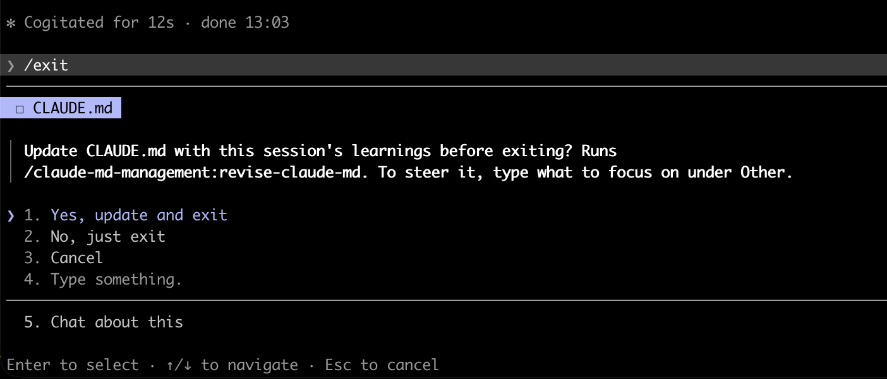

# manueldelgado-mods

Claude Code mods by Manuel Delgado Tenorio.

## Install

In Claude Code:

```
/plugin marketplace add manueldelgado/manueldelgado-mods
/plugin install exit-memory-update@manueldelgado-mods
/reload-plugins
```

Or from a shell:

```
claude plugin marketplace add manueldelgado/manueldelgado-mods
claude plugin install exit-memory-update@manueldelgado-mods --scope user
```

## Mods

### exit-memory-update

When you run `/exit` (or `/quit`), asks whether to update CLAUDE.md with what was learned in the session:

- **Yes, update and exit**: if the [CLAUDE.md Management](https://github.com/anthropics/claude-plugins-official) plugin (`claude-md-management`) is installed, runs its `/claude-md-management:revise-claude-md` skill; otherwise Claude reviews the session and makes targeted edits to the project's CLAUDE.md itself. A status line shows while it runs; when it finishes, a band summarizes the edits and counts down to exit, with **Exit now** and **Stay**. If the update is interrupted or fails, the session stays open.
- **Type something**: same as Yes, with your text as guidance on what to record.
- **No, just exit**: exits right away.
- **Cancel**: stays in the session.



It doesn't ask in sessions with no messages, or in `claude -p` runs.

**Limitation:** Ctrl+C, Ctrl+D and `/clear` end the session without going through `/exit`, and Claude Code gives mods only about 1.5 seconds at that point. That's too short to ask or to run an update, so use `/exit` when you want the prompt.

## Develop

```
claude plugin validate exit-memory-update
claude plugin test exit-memory-update
```

## License

MIT
