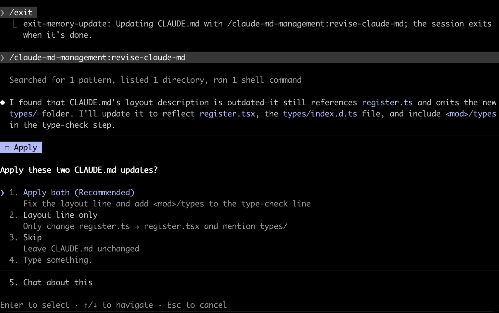

# exit-memory-update

A Claude Code mod that, when you run `/exit` (or `/quit`), asks whether to update CLAUDE.md with what was learned in the session before leaving.

## Install

```
/plugin marketplace add manueldelgado/manueldelgado-mods
/plugin install exit-memory-update@manueldelgado-mods
/reload-plugins
```

## What it does

When you run `/exit`, it asks: *"Update CLAUDE.md with this session's learnings before exiting?"* The question says how the update will run (the `claude-md-management` skill, or Claude editing directly) and, if CLAUDE.md was already edited earlier in the session, says so.

- **Yes, update and exit**: updates CLAUDE.md (see below). While it runs, a status line under the prompt reads *"Updating CLAUDE.md, then exiting · Esc to stay"*. When it finishes, a band above the prompt shows how many edits were made to CLAUDE.md and counts down five seconds before exiting, with **Exit now** (`1`) and **Stay** (`2`) buttons. Typing a new prompt or pressing Esc during the update keeps the session open, and so does an update that fails.
- **Type something**: same as Yes, with your text as guidance on what to record (for example, *"the test commands"*).
- **No, just exit**: exits right away.
- **Cancel**: stays in the session.

It doesn't ask in sessions where you haven't sent a message, or in non-interactive runs (`claude -p`, the Agent SDK).

## Screenshots

Running `/exit` in a session asks first. The question names how the update will run:


After "Yes", the update runs as a normal turn. Here `claude-md-management`'s skill proposes its CLAUDE.md edits, and the session exits once the turn finishes:



## Hooks, commands and prompts

Full disclosure of what the mod hooks, runs and sends:

- **Hooks `/exit`** (the `command.run` event for `exit`): it holds the exit to show the question above. "No" lets the exit go through unchanged; "Cancel" stops it. It hooks no other command.
- **Hooks `turn.complete`**: only to notice when the CLAUDE.md update turn has finished. It reads nothing from the turn except whether it ended normally.
- **Hooks `tool.call`**: to count successful `Edit`/`Write` calls on a file named `CLAUDE.md`, for the question and the band. It reads only the tool name, the file path and whether the call succeeded, and changes nothing.
- **Hooks `prompt.submit`**: only to cancel the exit countdown when you send a new prompt. It passes the prompt through unread and unchanged.
- **Hooks `session.start`**: to reset its counters.
- **Draws the band above the prompt** (`ui.render` for `AbovePrompt`) during the countdown only, and a status line while the update runs.
- **Runs slash commands itself**, only after you pick "Yes":
  - `/claude-md-management:revise-claude-md`, if the [CLAUDE.md Management](https://github.com/anthropics/claude-plugins-official) plugin (`claude-md-management`) is installed. It finds out by listing the session's available commands. Text you typed under "Type something" is passed as the command's arguments.
  - `/exit`, when the countdown ends or you press **Exit now**, to complete the exit you asked for.
- **Submits one prompt**, only after you pick "Yes" (or type under "Type something") and only when `claude-md-management` is *not* installed. The prompt is fixed text, plus the text you typed under "Type something" if any, and carries no conversation content or other data. It asks Claude to review the current session, read the project's CLAUDE.md (creating it if missing), add durable, non-obvious learnings (commands, conventions, architecture facts, gotchas, stated preferences) as concise, targeted edits, and summarize what changed. The full text is `FALLBACK_PROMPT` in [`hooks/register.tsx`](hooks/register.tsx).

See [PRIVACY.md](PRIVACY.md). The mod makes no network requests, and it doesn't read or write files itself. Any file edits are made by Claude in the normal turn, under your usual permission settings.

## Limitation

Ctrl+C, Ctrl+D and `/clear` end the session without going through `/exit`, and Claude Code gives mods only about 1.5 seconds at that point. That's too short to ask or to run an update, so use `/exit` when you want the prompt.

## License

MIT
